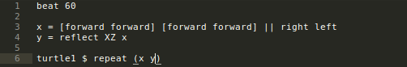
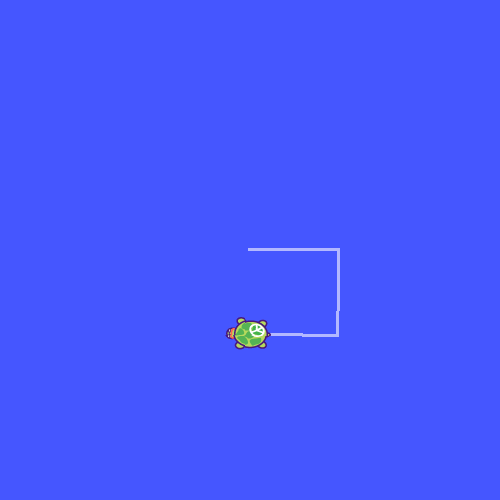
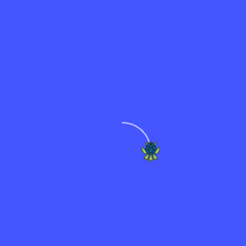
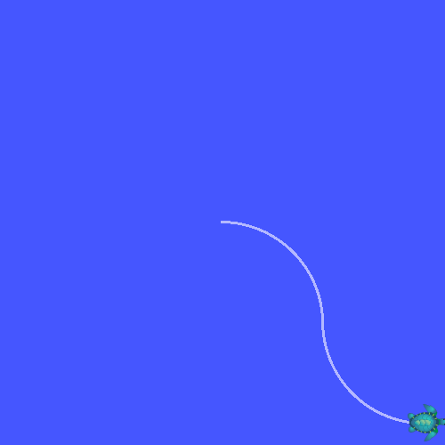
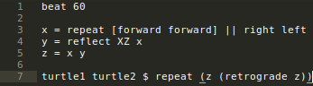
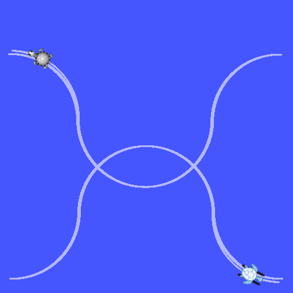
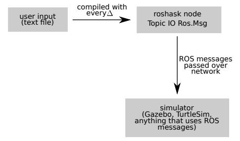

# Introduction

The goal behind the development of Improv is to create a language for
live-coding of rhythm-based robot motion. An inspiration for this project was
[TidalCycles](https://tidalcycles.org/), a language for live-coding music
pattern.\[1\] As described by Alex McLean in his paper on Tidal, "*Live coding
is where source code is edited and interpreted in order to modify and control a
running process.*"\[2\] Similar to how Tidal allows users to design complex
musical patterns on the fly, we wanted for users to be able to design complex
robotic dances on the fly. Thus, the essential concerns in the creation of this
language include:

-   **Ease of use**. Complex motions should be possible to create quickly and
    easily (after some practice) for live-coding to be feasible.
-   **Rhythm-based movement**. Current robot movement languages, such as Logo,
    are focused on distance and position-based commands. We want to create a
    language where movement is based around following a beat, much like a human
    dance.

You can read more on the motivations behind Improv and back-end development
details in Alli Nilles' paper.\[2\]

For my part in this project, I developed a parser and interpreter for user
commands as well as some development of new dance manipulating functions, such
as reverse and retrograde. The project is written in Haskell, and when I
initially joined the user was required to understand Haskell before being able
to learn Improv. It also did not include functionality for the user to quickly
change their program and submit the new commands to the robot, requiring
re-compilation of the user program (which could take 10-20 seconds) with every
change.

My goal was to develop an improved language that a user could pick up with no
prior Haskell (or even coding) knowledge and that allowed for changes to be
quickly submitted to the robot.

Design Decisions
================

Differences from other robot languages
--------------------------------------

Movement commands are called **Dance**s; when several Dances are composed
together, they become a new, more complicated Dance. This is done by composing
the rotational and linear velocities together for the given Dances. This makes
movement easier to reason about when it comes to composing a set of complicated
movements together.

The biggest design decision made was to base movements on time spent rather than
distance. Movements are organized into units, where each unit is performed in
one beat. To give an example of this, a user can specify a series of commands
such as *move forward for one beat, turn right for one beat, move forward for
one beat* with the command:

`forward right forward`

They can also choose to specify a series of commands such as *move forward, turn
right, then move forward, all in one beat* as follows:

`[forward right forward]`

Because of this beat-based movement, it is easier to create a dance-like
sequence of movements with timing. This also makes the language more concise,
allowing for easier live-coding.

Contrast this with a language such as Logo, where doing something similar would
require the series of commands

`forward 50`

`right 90`

`forward 50`

This distance based programming does not readily allow the user to associate
movement with a beat. It is also far less concise, making live-coding difficult.

Input format
------------

The user program file is parsed line by line, with each line having a specific
possible structure. Empty lines (those containing just the newline character and
spaces) are skipped. The three possible line structures are as follows:

-   Beats per minute (bpm) definition. The user must define the bpm in the first
    line of the file with the format: `beat BPM`. For example, if the user wants
    the bpm to be 120, they can write `beat 120` as the first line of the file.
-   Channel command definition. Each robot being controlled is associated with a
    "channel" name (user-defined), so submitting commands must include a channel
    name. To define a dance for a given channel to perform, the line must be in
    the format: `channelName1 ... channelNameN $ DANCE`. The user can specify
    either a single channel or multiple channels for the dance to be submitted
    to.
-   Variable definition. The user can define a variable to be associated with a
    dance with the format: `variableName = DANCE`. This variable can then be
    re-used in other parts of the program, and will be converted to the
    associated Dance wherever it is used.

The user program file might thus look something like this:

{#id .class width="502"}

Dance combinators
-----------------

With these three simple types of lines and a set of basic movements, including
**forward**, **backward**, **right**, and **left**, the user can create a wealth
of complex movement patterns. To allow for complex movements with concise input
command strings, we included two important operators, **series** and
**parallel**. Series and parallel are used to compose dances together in unique
and interesting ways.

-   **Series**: as shown in the above example, the series combinator allows the
    user to compress a series of Dances into a single unit, and can be done by
    surrounding a sequence of dances with brackets **\[\]**. For example, this
    sequence of movements would take 3 beats total, with the middle sequence of
    movements all peformed on the 2nd beat:

    `forward [right forward right] forward`

{#id .class width="200"}

\pagebreak

-   **Parallel**: The parallel combinator allows the user to run several Dances
    in parallel. What this means is that curves and other complicated movements
    can be described very concisely. For example, the following commands would
    cause the robot to move in a quarter-circle arc in one beat:

    `forward || right`

{#id .class width="200"}

With just these two combinators, we can describe many complicated movements in
an intuitive fashion! For example, we can do the following to cause the robot to
move in a long "S" pattern:

`[forward forward] [forward forward] || right left`

{#id .class width="200"}

\pagebreak

Utility functions
-----------------

We also implemented several movement manipulation functions, **repeat**,
**reflect**, **reverse**, and **retrograde**. These functions continue the trend
of increasing functionality while keeping commands concise, and were chosen
because of their utility in making defining dancelike movements easier.

-   **Repeat** can be used to either repeat a given Dance infinitely or for a
    certain number of iterations. T

-   **Reflect** can be used to reflect a given Dance across a given axis (XY,
    XZ, or YZ), which can be useful if the user needs to repeat a set of
    movements in a different direction.

-   **Reverse** reverses the order of movements being performed in the given
    Dance.

-   **Retrograde** flips the given Dance over all three axes.

Combining these functionalities together, the following program will cause two
robots, starting facing opposite directions, to perform a cool pattern!

{#id .class
width="347"}

{#id .class
width="200"}

\pagebreak

Development Decisions and Challenges
====================================

My work was on developing an interpreter to parse user input and convert it to
ROS messages to be published to the simulator. Below is a diagram giving an
overview of how the user input file is converted to a ROS Node, which is then
published to the simulator (credit to Alli Nilles' paper). \[2\]

{#id .class width="485"}

Parsing
-------

I used the Parsec package to help with the firs step, parsing user input. The
major benefits of using Parsec include built in functionality to report error
line and column on invalid input structure, along with possible valid grammar
productions to assist the user in correcting errors.\[3\] This removed a lot of
the difficulty in creating the parser, and made it easier to provide the user
with informative feedback on how to properly structure their input. Once the
parsec function parses the input, it stores it in tree form with the following
[Algebraic Data Type](https://wiki.haskell.org/Algebraic_data_type) (ADT):

``` {.haskell}
data Tree = Node [Tree]
          | Bracket [Tree]
          | Leaf String
```

A Node contains commands that were grouped within parentheses, a Bracket
contains commands that were grouped within brackets, and a Leaf contains any
strings not grouped within parentheses or brackets. Storing the parsed strings
in tree form makes it easy to then convert them to Dances in the rest of the
interpreter.

Input to commands conversion
----------------------------

The biggest difficulty I had was with the lack of just-in-time compilation in
Haskell, i.e. it is not possible to take Haskell code and compile it during
program execution. This meant that I had to create dictionaries from input
command strings to Haskell code, rather than simply compiling the input commands
as is. This also means that if the user wishes to define new basic commands in
addition to the ones we have created, they will have to edit the source code of
our project themselves, rather than being able to include this code in the user
program file. This is an unfortunate limitation of our usage of Haskell for the
project.

Dance data returned by interpreter functions is in the form of a map of robot
names (e.g. "turtle1", "turtle2", etc.) to associated Dances - converted to ROS
messages when being sent to a ROS node - for that robot. In order to handle
non-input structure related errors (such as giving a non-existent movement
command), I used the [Either
monad](https://www.schoolofhaskell.com/school/starting-with-haskell/basics-of-haskell/10_Error_Handling#the-either-monad),
where data returned by function calls is in the wrapped as either `Left ERROR`
or `Right DATA`. This allowed for me to construct custom exception type (called
ParseErr), containing a line number and error message. This makes the type
signature for returned data along the lines of:

``` {.haskell}
Either ParseErr (Map String OurDance)
```

Where the ADT definition for ParseErr is as follows (the Integer is the line
number, and the String is the error message):

``` {.haskell}
data ParseErr = ParseErr Integer String
```

One compromise with this approach is that data returned by function calls in the
Parser must be unwrapped before being used, but it allowed for more flexibility
in terms of how the error messages can be handled as compared to simply throwing
a built-in exception. If I were to do this again, I would likely forgo this
method of handling errors and instead simply use exceptions.

Custom variables
----------------

One functionality I wanted to have included was allowing users to assign custom
variables with associated movements. This functionality is a bit harder to
implement in Haskell, a pure functional language, as compared to a procedural
language. Without state I would have to manually pass through a dictionary
containing variables and associated movements at each recursive function call,
where I would be able to simply store and retrieve this information from a class
or global variable in a procedural language. To make this easier to handle, I
used the State monad, which makes it possible to monadically simulate global
state in a language doesn't naturally contain it.\[7\] This lets me avoid
handling the dictionary when not needed, and helps to handle storing and
retrieving the command dictionary when needed.

Here is an example of how this is used in the interpreter:

``` {.haskell}
commandDefs <- get
case Map.lookup commandStr commandDefs of
     Just commands -> convertCommands robos commands
     Nothing -> return $ Right $ ParseErr line "Command not found"
```

This code gets the dictionary of variable names to Dance definitions and stores
it in the commandDefs variable, which is then used to look up a given command
string to check if it exists.

This does adds another layer of unwrapping for data returned by function calls
on top of the usage of the Either monad, making the type signature for returned
data look like:

``` {.haskell}
S.State CommandState (Either ParseErr (Map String OurDance))
```

However, the reduced complexity within the functions themselves makes this
additional type complexity worthwhile.

Future Work
===========

Interpreter improvements
------------------------

The biggest thing I would like to include in future development would be
multi-robot commands, such as single commands that allow the user to quickly
specify inter-robot movements. For example, an "approach" command being
submitted to multiple robots might make them approach each other, either up to a
certain radius or until they are touching:

`turtle1 turtle2 turtle3 $ approach`

This inter-robot movement functionality would enhance the dance nature of the
language, and would make it even easier to create complicated and expressive
patterns of movement. A "mirror" command being submitted to multiple robots
might make them perform the same commands, but rotated at a angle proportionate
to the number of robots the command is submitted to:

`turtle1 turtle2 turtle3 $ mirror`

I would also like to add more helper functions. This could include functionality
such as loops with an incrementing/decrementing variable, randomized movements,
and so on. Another potential addition is more parallel functionality; the
current parallel operator cuts off movements at the shortest dance in parallel.
It could be useful to add different parallel operators that might, for example,
cut off movements at the longest dance instead, or compress shortest dances to
fit the longest dance (or vice versa).

Another improvement would be to make it easier for users to define new basic
movements or functions other than the ones we have defined. As of now, it is not
quite clear or standardized as to how a user would be able to do so. Increasing
the modularity of the project would be a big improvement, and would encourage
more users to use our language.

I would also like to re-work the way that error messages are handled, using
exceptions rather than the Either monad; while the current way they are handled
allows for greater flexibility, it also greatly increases the difficulty of
writing clean and understandable code.

Simulator improvements
----------------------

As of now, our testing has been on a simple turtle simulator, and recently we
have [integrated our code with
Gazebo](https://www.youtube.com/watch?v=GGw5PqNCt70&feature=youtu.be), a more
realistic 3D robot simulator. Testing what we have with real robots in the
future, including more complex robots than the current simple roomba-style ones,
would be exciting and would open up some new possibilites for the kind of dances
we can make.

Bibliography
============

\[1\] *TidalCycles.* TidalCycles, 2017, https://tidalcycles.org/. Accessed Dec
10, 2017.

\[2\] McLean, Alex. *Making Programming Languages to Dance to: Live Coding with
Tidal.* Published online: https://tidalcycles.org/credits.html, 2014.

\[3\] Nilles, Alexandra. *Improv - a language for explorations in movement
design.* Published online:
http://nilles2.web.engr.illinois.edu/media/improv\_paper\_17.pdf, 2017.

\[4\] Leijen, Daan. *Parsec: Direct Style Monadic Parser Combinators For The
Real World.* Published online:
https://www.microsoft.com/en-us/research/wp-content/uploads/2016/02/parsec-paper-letter.pdf,
Oct 4, 2001.

\[5\] *Algebraic Data Types.* Haskell Wiki, 2017,
https://wiki.haskell.org/Algebraic\_data\_type. Accessed Dec 10, 2017.

\[6\] *Error handling.* School of Haskell, 2017,
https://www.schoolofhaskell.com/school/starting-with-haskell/basics-of-haskell/10\_Error\_Handling\#the-either-monad.
Accessed Dec 10, 2017.

\[7\] Wadler, Philip. *Monads for functional programming.* Published online:
http://homepages.i-nf.ed.ac.uk/wadler/papers/marktoberdorf/baastad.pdf, April
19, 2006.
