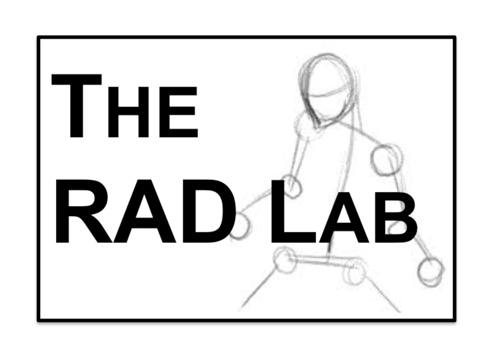

Improv: Live Coding for Robot Motion Design 
=====


\vspace{-1em}

\cbegin

\column{0.5\textwidth}

```python
if __name__ == '__main__':
  pub = rospy.Publisher(
    'robot/cmd_vel',Twist)
  rospy.init_node('publisher_node')
  loop_rate = rospy.Rate(5)
  while not rospy.is_shutdown():
    vel=Twist() 
    vel.linear.x = 1.0 
    vel.angular.z = 1.0 
    pub.publish(vel) 
    loop_rate.sleep()
```

\column{0.5\textwidth}

\small \texttt{robot \$ forward || left}

\cend

\centering

{width=8cm}\

\vspace{-3em}

\hfill {width=2cm}\
