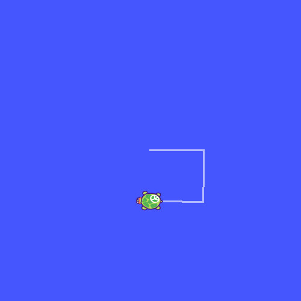
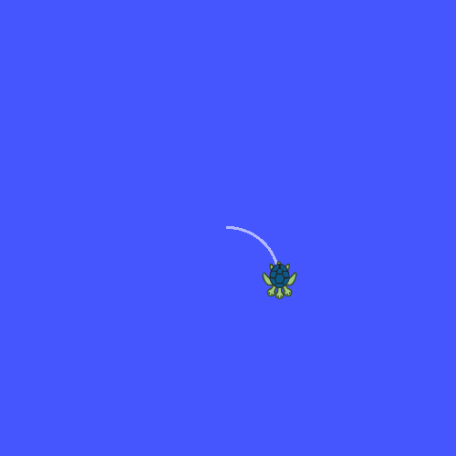
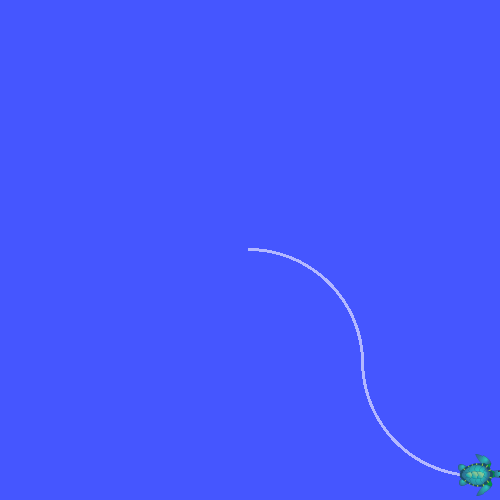
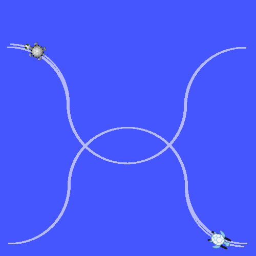
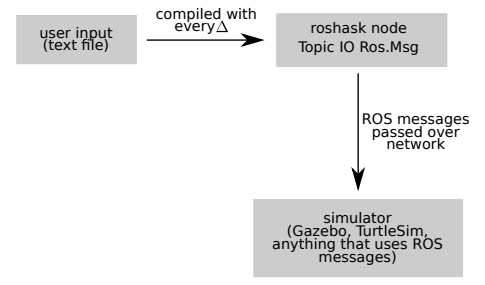

# Introduction

The goal behind the development of Improv is to create a language for live-coding of rhythm-based robot motion. An inspiration for this project was [TidalCycles](https://tidalcycles.org/), a language for live-coding music pattern.[1] As described by Alex McLean in his paper on Tidal, "*Live coding is where source code is edited and interpreted in order to modify and control a running process.*"[2] Similar to how Tidal allows users to design complex musical patterns on the fly, we wanted for users to be able to design complex robotic dances on the fly. Thus, the essential concerns in the creation of this language include:

* **Ease of use**. Complex motions should be possible to create quickly and easily (after some practice) for live-coding to be feasible.
* **Rhythm-based movement**. Current robot movement languages, such as Logo, are focused on distance and position-based commands. We want to create a language where movement is based around following a beat, much like a human dance. 

You can read more on the motivations behind Improv and back-end development details in Alli Nilles' paper.[2]

For my part in this project, I developed a parser and interpreter for user commands as well as some development of new dance manipulating functions, such as reverse and retrograde. The project is written in Haskell, and when I initially joined the user was required to understand Haskell before being able to learn Improv. It also did not include functionality for the user to quickly change their program and submit the new commands to the robot, requiring re-compilation of the user program (which could take 10-20 seconds) with every change. 

My goal was to develop an improved language that a user could pick up with no prior Haskell (or even coding) knowledge and that allowed for changes to be quickly submitted to the robot.

# Design Decisions

## Differences from other robot languages
Movement commands are called **Dance**s; when several Dances are composed together, they become a new, more complicated Dance. This is done by composing the rotational and linear velocities together for the given Dances. This makes movement easier to reason about when it comes to composing a set of complicated movements together.

The biggest design decision made was to base movements on time spent rather than distance. Movements are organized into units, where each unit is performed in one beat. To give an example of this, a user can specify a series of commands such as *move forward for one beat, turn right for one beat, move forward for one beat* with the command:

``forward right forward``

They can also choose to specify a series of commands such as *move forward, turn right, then move forward, all in one beat* as follows:

``[forward right forward]``

Because of this beat-based movement, it is easier to create a dance-like sequence of movements with timing. This also makes the language more concise, allowing for easier live-coding.

Contrast this with a language such as Logo, where doing something similar would require the series of commands 

``forward 50``

``right 90``

``forward 50``

This distance based programming does not readily allow the user to associate movement with a beat. It is also far less concise, making live-coding difficult. 

## Input format

The user program file is parsed line by line, with each line having a specific possible structure. Empty lines (those containing just the newline character and spaces) are skipped. The three possible line structures are as follows:

* Beats per minute (bpm) definition. The user must define the bpm in the first line of the file with the format: ``beat BPM``. For example, if the user wants the bpm to be 120, they can write ``beat 120`` as the first line of the file. 
* Channel command definition. Each robot being controlled is associated with a "channel" name (user-defined), so submitting commands must include a channel name. To define a dance for a given channel to perform, the line must be in the format: ``channelName1 ... channelNameN $ DANCE``. The user can specify either a single channel or multiple channels for the dance to be submitted to.
* Variable definition. The user can define a variable to be associated with a dance with the format: ``variableName = DANCE``. This variable can then be re-used in other parts of the program, and will be converted to the associated Dance wherever it is used. 

The user program file might thus look something like this:

{#id .class width=502}

## Dance combinators

With these three simple types of lines and a set of basic movements, including **forward**, **backward**, **right**, and **left**, the user can create a wealth of complex movement patterns. To allow for complex movements with concise input command strings, we included two important operators, **series** and **parallel**. Series and parallel are used to compose dances together in unique and interesting ways. 

* **Series**: as shown in the above example, the series combinator allows the user to compress a series of Dances into a single unit, and can be done by surrounding a sequence of dances with brackets **[]**. For example, this sequence of movements would take 3 beats total, with the middle sequence of movements all peformed on the 2nd beat:

	``forward [right forward right] forward``

{#id .class width=200}

\pagebreak


* **Parallel**: The parallel combinator allows the user to run several Dances in parallel. What this means is that curves and other complicated movements can be described very concisely. For example, the following commands would cause the robot to move in a quarter-circle arc in one beat:

	``forward || right``

{#id .class width=200}

With just these two combinators, we can describe many complicated movements in an intuitive fashion! For example, we can do the following to cause the robot to move in a long "S" pattern:

``[forward forward] [forward forward] || right left``

{#id .class width=200}

\pagebreak

## Utility functions

We also implemented several movement manipulation functions, **repeat**, **reflect**, **reverse**, and **retrograde**. These functions continue the trend of increasing functionality while keeping commands concise, and were chosen because of their utility in making defining dancelike movements easier. 

* **Repeat** can be used to either repeat a given Dance infinitely or for a certain number of iterations. T

* **Reflect** can be used to reflect a given Dance across a given axis (XY, XZ, or YZ), which can be useful if the user needs to repeat a set of movements in a different direction.

* **Reverse** reverses the order of movements being performed in the given Dance.

* **Retrograde** flips the given Dance over all three axes.

Combining these functionalities together, the following program will cause two robots, starting facing opposite directions, to perform a cool pattern!

{#id .class width=347}

{#id .class width=200}

\pagebreak

# Development Decisions and Challenges

My work was on developing an interpreter to parse user input and convert it to ROS messages to be published to the simulator. Below is a diagram giving an overview of how the user input file is converted to a ROS Node, which is then published to the simulator (credit to Alli Nilles' paper). [2]

{#id .class width=485}

## Parsing

I used the Parsec package to help with the firs step, parsing user input. The major benefits of using Parsec include built in functionality to report error line and column on invalid input structure, along with possible valid grammar productions to assist the user in correcting errors.[3] This removed a lot of the difficulty in creating the parser, and made it easier to provide the user with informative feedback on how to properly structure their input. Once the parsec function parses the input, it stores it in tree form with the following [Algebraic Data Type](https://wiki.haskell.org/Algebraic_data_type) (ADT):

```haskell
data Tree = Node [Tree]
          | Bracket [Tree]
          | Leaf String
```

A Node contains commands that were grouped within parentheses, a Bracket contains commands that were grouped within brackets, and a Leaf contains any strings not grouped within parentheses or brackets. Storing the parsed strings in tree form makes it easy to then convert them to Dances in the rest of the interpreter.

## Input to commands conversion

The biggest difficulty I had was with the lack of just-in-time compilation in Haskell, i.e. it is not possible to take Haskell code and compile it during program execution. This meant that I had to create dictionaries from input command strings to Haskell code, rather than simply compiling the input commands as is. This also means that if the user wishes to define new basic commands in addition to the ones we have created, they will have to edit the source code of our project themselves, rather than being able to include this code in the user program file. This is an unfortunate limitation of our usage of Haskell for the project.

Dance data returned by interpreter functions is in the form of a map of robot names (e.g. "turtle1", "turtle2", etc.) to associated Dances - converted to ROS messages when being sent to a ROS node - for that robot. In order to handle non-input structure related errors (such as giving a non-existent movement command), I used the [Either monad](https://www.schoolofhaskell.com/school/starting-with-haskell/basics-of-haskell/10_Error_Handling#the-either-monad), where data returned by function calls is in the wrapped as either ``Left ERROR`` or ``Right DATA``. This allowed for me to construct custom exception type (called ParseErr), containing a line number and error message. This makes the type signature for returned data along the lines of:

```haskell
Either ParseErr (Map String OurDance)
```

Where the ADT definition for ParseErr is as follows (the Integer is the line number, and the String is the error message):

```haskell
data ParseErr = ParseErr Integer String
```

One compromise with this approach is that data returned by function calls in the Parser must be unwrapped before being used, but it allowed for more flexibility in terms of how the error messages can be handled as compared to simply throwing a built-in exception. If I were to do this again, I would likely forgo this method of handling errors and instead simply use exceptions.

## Custom variables

One functionality I wanted to have included was allowing users to assign custom variables with associated movements. This functionality is a bit harder to implement in Haskell, a pure functional language, as compared to a procedural language. Without state I would have to manually pass through a dictionary containing variables and associated movements at each recursive function call, where I would be able to simply store and retrieve this information from a class or global variable in a procedural language. To make this easier to handle, I used the State monad, which makes it possible to monadically simulate global state in a language doesn't naturally contain it.[7] This lets me avoid handling the dictionary when not needed, and helps to handle storing and retrieving the command dictionary when needed.

Here is an example of how this is used in the interpreter:

```haskell
commandDefs <- get
case Map.lookup commandStr commandDefs of
     Just commands -> convertCommands robos commands
     Nothing -> return $ Right $ ParseErr line "Command not found"
```

This code gets the dictionary of variable names to Dance definitions and stores it in the commandDefs variable, which is then used to look up a given command string to check if it exists. 

This does adds another layer of unwrapping for data returned by function calls on top of the usage of the Either monad, making the type signature for returned data look like:

```haskell
S.State CommandState (Either ParseErr (Map String OurDance))
```

However, the reduced complexity within the functions themselves makes this additional type complexity worthwhile.
 
# Future Work

## Interpreter improvements

The biggest thing I would like to include in future development would be multi-robot commands, such as single commands that allow the user to quickly specify inter-robot movements. For example, an "approach" command being submitted to multiple robots might make them approach each other, either up to a certain radius or until they are touching:

``turtle1 turtle2 turtle3 $ approach``

This inter-robot movement functionality would enhance the dance nature of the language, and would make it even easier to create complicated and expressive patterns of movement. A "mirror" command being submitted to multiple robots might make them perform the same commands, but rotated at a angle proportionate to the number of robots the command is submitted to:

``turtle1 turtle2 turtle3 $ mirror``

I would also like to add more helper functions. This could include functionality such as loops with an incrementing/decrementing variable, randomized movements, and so on. Another potential addition is more parallel functionality; the current parallel operator cuts off movements at the shortest dance in parallel. It could be useful to add different parallel operators that might, for example, cut off movements at the longest dance instead, or compress shortest dances to fit the longest dance (or vice versa).

Another improvement would be to make it easier for users to define new basic movements or functions other than the ones we have defined. As of now, it is not quite clear or standardized as to how a user would be able to do so. Increasing the modularity of the project would be a big improvement, and would encourage more users to use our language. 

I would also like to re-work the way that error messages are handled, using exceptions rather than the Either monad; while the current way they are handled allows for greater flexibility, it also greatly increases the difficulty of writing clean and understandable code.

## Simulator improvements

As of now, our testing has been on a simple turtle simulator, and recently we have [integrated our code with Gazebo](https://www.youtube.com/watch?v=GGw5PqNCt70&feature=youtu.be), a more realistic 3D robot simulator. Testing what we have with real robots in the future, including more complex robots than the current simple roomba-style ones, would be exciting and would open up some new possibilites for the kind of dances we can make.

# Bibliography
[1] *TidalCycles.* TidalCycles, 2017, https://tidalcycles.org/. Accessed Dec 10, 2017. 

[2] McLean, Alex. *Making Programming Languages to Dance to: Live Coding with Tidal.* Published online: https://tidalcycles.org/credits.html, 2014.

[3] Nilles, Alexandra. *Improv - a language for explorations in movement design.* Published online: http://nilles2.web.engr.illinois.edu/media/improv_paper_17.pdf, 2017.

[4] Leijen, Daan. *Parsec: Direct Style Monadic Parser Combinators For The Real World.* Published online: https://www.microsoft.com/en-us/research/wp-content/uploads/2016/02/parsec-paper-letter.pdf, Oct 4, 2001.

[5] *Algebraic Data Types.* Haskell Wiki, 2017, https://wiki.haskell.org/Algebraic_data_type. Accessed Dec 10, 2017.

[6] *Error handling.* School of Haskell, 2017, https://www.schoolofhaskell.com/school/starting-with-haskell/basics-of-haskell/10_Error_Handling#the-either-monad. Accessed Dec 10, 2017.

[7] Wadler, Philip. *Monads for functional programming.* Published online: http://homepages.i-nf.ed.ac.uk/wadler/papers/marktoberdorf/baastad.pdf, April 19, 2006.